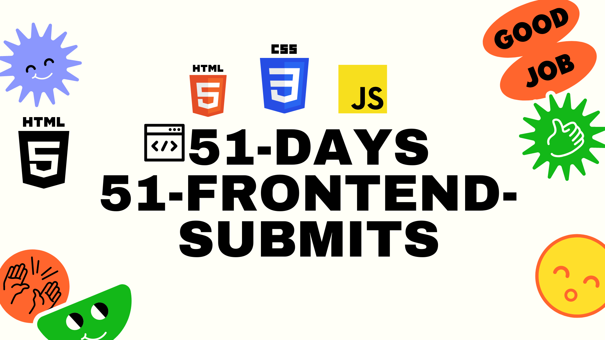

# 51days51submits

 ## This challenge is started on february 24,2021 📅
 ### In this challenge a submitted 51 little to medium size projects. Sometimes I did a little website component or sometimes some javaScript app as a submit. I did it to boost my HTML, CSS & JS skills. Down here you will find all the live previews of projects. 

| Day   | Project Name    | Source Code/Preview |
| :---  | :------------- | :------------------ |  
| Day-1 | CSS Mousemove Effects  | https://CSS-Mousemove-Effects.aayushjaincode.repl.co|
| Day-2 | Live Character Counter  | https://word-counter.aayushjaincode.repl.co |
| Day-3 | Landing-page-pepsi | https://landing-page-pepsi.aayushjaincode.repl.co |
| Day-4 | Random-Password-genrator & Copy | https://password-genrator.aayushjaincode.repl.co |

## Linkedin
    https://www.linkedin.com/in/aayush-jain-code/
